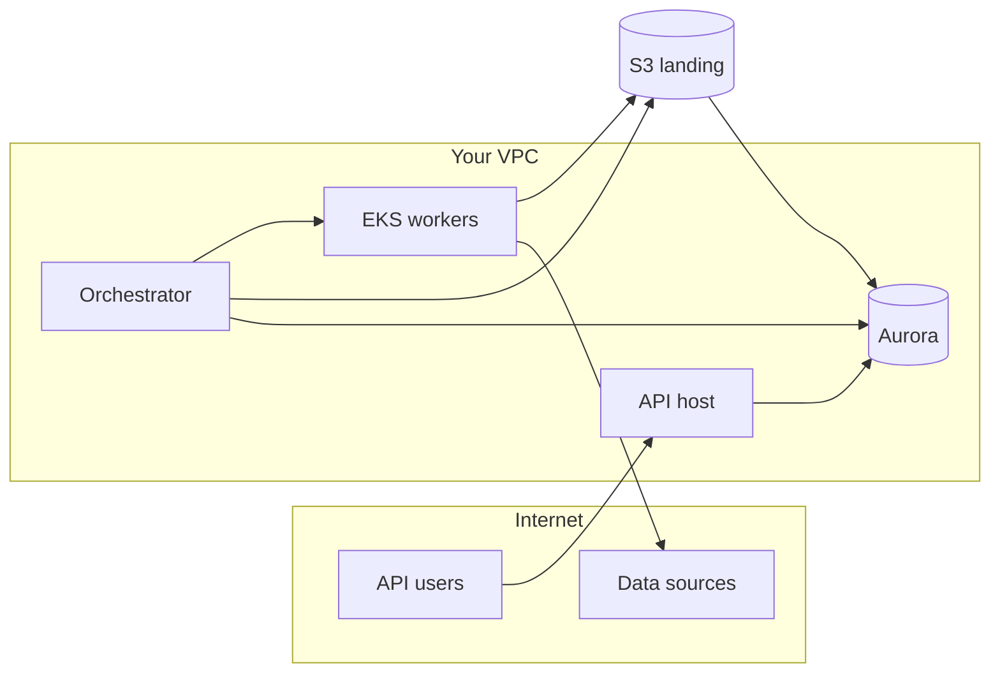

# AWS scaled deployment — components explained

This page explains **what each part of the AWS scaled stack is**, in plain language, and **how opendata-etl uses it**. It is written for developers who are new to cloud infrastructure. For step-by-step commands, see [First-time AWS deploy](aws-first-deploy.md).

## Big picture

A **scaled** deployment splits work across several machines and services instead of running everything on one laptop (the **`lite`** profile in Docker Compose).

| Concern | Service | One-sentence role |
|---------|---------|-------------------|
| Permanent data | **Aurora PostgreSQL** | Databases, tables, API query target |
| Staging files | **S3** | CSV landing zone before load |
| Batch compute | **EKS** (Kubernetes) | Runs heavy extract/derived jobs as short-lived **Jobs** |
| Scheduling | **Orchestrator** (EC2 or EKS) | Dagster — decides *when* to run jobs and runs load steps |
| Public queries | **API host** | FastAPI — read-only SQL for apps |
| Images | **ECR** | Private Docker registry for framework and derived images |
| Secrets | **SSM Parameter Store** | Passwords and config (not in git) |
| Network | **VPC** | Private network isolating databases from the public internet |

## Networking (VPC)

Think of a **VPC** (Virtual Private Cloud) as your own private slice of AWS’s network.

### Pieces

| Piece | What it is | Why opendata-etl needs it |
|-------|------------|---------------------------|
| **VPC** | Isolated network (e.g. `10.20.0.0/16`) | Keeps Aurora and admin tools off the open internet |
| **Subnets** | Sub-ranges inside the VPC, usually per **availability zone** (AZ) | Aurora and EKS spread across AZs for resilience |
| **Public subnet** | Subnet with a route to an **Internet Gateway** | NAT gateway lives here; optional public load balancers |
| **Private subnet** | Subnet whose default route goes to a **NAT gateway**, not directly to the internet | Aurora, orchestrator, EKS nodes, API hosts |
| **Internet Gateway (IGW)** | VPC attachment for inbound/outbound internet | Used by public subnets |
| **NAT gateway** | Allows **private** instances to initiate outbound connections (downloads, AWS APIs) | Orchestrator and workers pull images and source data without public IPs on those instances |
| **Security groups** | Virtual firewalls per resource — allow/deny **ports** and **sources** | Split rules: API vs orchestrator vs database vs workers |

### Traffic patterns

1. **API user → API host → Aurora** — Only port 5432 from the API security group to Aurora; API does not touch S3.
2. **Orchestrator → EKS API** — Orchestrator submits Kubernetes Jobs (extract/derived).
3. **Worker pods → S3** — Upload CSVs under `extract/` and `derived/`.
4. **Orchestrator → S3 → Aurora** — Load step reads from S3 (download or server-side COPY) and writes to Postgres.
5. **Workers → external data** — HTTP/S3 sources on the internet via NAT egress.

### What is *not* exposed by default

- Aurora has **no public IP** in the reference Terraform.
- Dagster UI (port 3000) should be restricted with `admin_cidr_blocks` (office/VPN CIDR), not `0.0.0.0/0`.
- S3 landing bucket is **private** (block public access).

## Aurora PostgreSQL

**Aurora** is AWS’s managed PostgreSQL-compatible database.

| Concept | Meaning for opendata-etl |
|---------|--------------------------|
| **Cluster** | Logical database; holds your data |
| **Writer instance** | Handles writes (ETL loads, provisioning) |
| **Storage** | Grows automatically; billed per GB-month |
| **Schemas** | One Postgres schema per definition repo (e.g. `nyc_housing`) |
| **PostGIS** | Extension for geographic data — enable with `CREATE EXTENSION postgis` per schema |

The framework **provisions roles**, runs **atomic table swap** loads, and gives the API **read-only** roles per schema. Protected schemas stay off the public read role.

## S3 landing bucket

**S3** is object storage (files). opendata-etl uses it as a **landing zone** — temporary-ish CSV storage between extract and load.

| Prefix | Contents |
|--------|----------|
| `extract/{dataset}/{date}/…` | Staging CSVs from dataset extract |
| `derived/{repo}/{job}/{run_id}/…` | Output CSVs from derived jobs |

Env vars: `S3_BUCKET`, optional `S3_ENDPOINT_URL` for non-AWS S3-compatible stores. On AWS, instances and pods use **IAM roles** instead of long-lived access keys.

**Lifecycle rules** (in Terraform) can expire old objects after N days to control cost.

## EKS (Elastic Kubernetes Service)

**Kubernetes** schedules containers. **EKS** is AWS’s managed control plane.

opendata-etl uses EKS for **batch work only** (Steps 21–22):

- Each extract or derived run becomes a **Job** (pod runs, exits, releases CPU).
- A **node group** is a pool of VMs that run those pods.
- **IRSA** (IAM Roles for Service Accounts) gives each pod an AWS role — e.g. read/write the landing bucket without putting keys in the image.

The **orchestrator does not have to run on EKS** — the reference Terraform uses a simpler **EC2** host for Dagster.

## EC2 orchestrator

**EC2** is a rented virtual machine.

The reference stack launches one instance for:

- `dagster-webserver` (UI)
- `dagster-daemon` (schedules, sensors)
- Load assets (COPY from S3 into Aurora)
- Submitting EKS Jobs

Connect with **SSM Session Manager** (no SSH keys required if IAM is set up). The instance profile grants S3, SSM, and EKS describe access.

## API host

A **separate** machine (or container service) runs only the **FastAPI** app:

- Serves public **read-only** queries.
- Should **not** run large downloads or derived Python (keeps API latency stable).

Can be an EC2 instance, ECS task, or similar — Terraform optionally creates a dedicated API EC2 with its own security group.

## ECR (Elastic Container Registry)

**ECR** stores Docker images privately.

| Image | Used by |
|-------|---------|
| Framework (`opendata-etl`) | Orchestrator, extract Jobs |
| Derived (per definition repo) | Derived Jobs with extra dependencies (e.g. geocoding) |

Push after `docker build`; workers and orchestrator pull at runtime.

## IAM and SSM

| Mechanism | Purpose |
|-----------|---------|
| **IAM roles** | Permissions attached to EC2/EKS instead of static keys |
| **Instance profile** | Attaches a role to an EC2 instance |
| **IRSA** | Attaches a role to a Kubernetes service account |
| **SSM Parameter Store** | Encrypted or plain config values (`DATABASE_URL` pieces, bucket name, manifest URI) |

Never commit secrets to git. Terraform may **generate** the Aurora master password and store it in SSM.

## How profiles map to AWS

| `definitions.yml` profile | AWS stack |
|---------------------------|-----------|
| `lite` | None required — local Compose |
| `scaled` | Aurora + S3 + EKS + split hosts |

| Env flag | Typical scaled value |
|----------|----------------------|
| `OPENDATA_LANDING_BACKEND` | `s3` |
| `OPENDATA_LOAD_BACKEND` | `copy_local` → `s3_copy_rds` (Step 20) |
| `OPENDATA_EXTRACT_EXECUTOR` | `eks` (Step 22) |
| `OPENDATA_DERIVED_EXECUTOR` | `eks` (Step 21) |

## Related docs

- [AWS scaled overview](aws-scaled.md)
- [First-time deploy](aws-first-deploy.md)
- [Ongoing maintenance](aws-maintenance.md)
- [Deployment profiles](../deployment-profiles.md)
