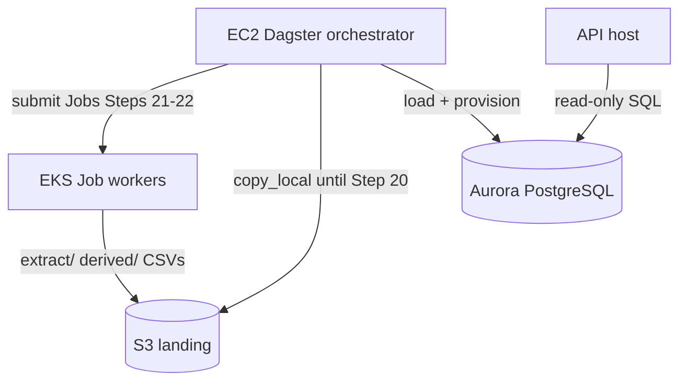

# AWS scaled deployment

Production deployments use **`profile: scaled`** in `definitions.yml` (see [`examples/definitions.prod.yml`](../../examples/definitions.prod.yml)). Terraform under [`infra/aws/`](../../infra/aws/) provisions Aurora, S3 landing, EKS, ECR, and split network security groups.

## Architecture



| Role | Host | Responsibilities |
|------|------|------------------|
| **Orchestrator** | EC2 (reference) or EKS | Dagster schedules, load assets, EKS Job submission |
| **API** | Separate EC2 / ALB | FastAPI read-only queries only |
| **Workers** | EKS Jobs | Heavy extract downloads and derived Python (Steps 21–22) |
| **Landing** | S3 | `extract/…` and `derived/{repo}/{job}/{run_id}/…` |
| **Database** | Aurora PostgreSQL | One schema per definition repo; PostGIS per schema |

## Terraform apply

```bash
cd infra/aws
cp terraform.tfvars.example terraform.tfvars
# Set admin_cidr_blocks to your VPN/office CIDR for Dagster port 3000

terraform init
terraform validate
terraform plan
terraform apply
```

Record outputs: `landing_bucket_name`, `aurora_cluster_endpoint`, `eks_cluster_name`, `ecr_framework_repository_url`, `eks_worker_irsa_role_arn`, `ssm_parameter_prefix`.

## Reference orchestrator: EC2 + Dagster

This repo’s Terraform **implements** the EC2 path (`create_orchestrator_instance = true`):

1. Connect via **SSM Session Manager** (no SSH key required).
2. Install Docker; pull the framework image from ECR.
3. Fetch secrets from SSM (`/opendata-etl/prod/aurora/master_password`, `database/url_template`, `landing/bucket`).
4. Run `dagster-webserver` and `dagster-daemon` with:

```bash
export OPENDATA_LANDING_BACKEND=s3
export OPENDATA_LOAD_BACKEND=copy_local          # Step 20 → s3_copy_rds
export OPENDATA_DERIVED_EXECUTOR=eks             # Step 21
export OPENDATA_EXTRACT_EXECUTOR=eks             # Step 22
export S3_BUCKET="<landing-bucket-from-output>"
export DATABASE_URL="postgresql://..."
export OPENDATA_DEFINITIONS_MANIFEST_PATH=/etc/opendata/definitions.yml
```

Mount or sync `definitions.yml` from a private config bucket (SSM parameter `definitions/manifest_s3_uri` is a placeholder until you set it).

## Alternative orchestrator: Dagster on EKS

Valid for teams that want the control plane on-cluster:

- Deploy Dagster Helm chart (or agent) into the same VPC; use the orchestrator IAM policy pattern (S3 + SSM + `eks:DescribeCluster`).
- Do **not** run extract/derived compute on the Dagster pod — workers remain **EKS Jobs** (Steps 21–22).
- Skip `create_orchestrator_instance` in Terraform or leave the EC2 instance stopped.

See [Dagster Kubernetes deployment](https://docs.dagster.io/deployment/oss/deployment-options/kubernetes) for chart details.

## PostGIS on Aurora

After Aurora is available and the framework has created schemas:

```sql
CREATE EXTENSION IF NOT EXISTS postgis;
-- Repeat per definition-repo schema as needed (e.g. nyc_housing).
```

Use a parameter group or migration job if you need additional extensions; Aurora PostgreSQL 16 supports PostGIS as a standard extension.

## ECR images

| Repository | Purpose |
|------------|---------|
| `{prefix}/framework` | `opendata-etl` Docker image (extract entrypoint, Dagster, API) |
| `{prefix}/derived` | Per-repo derived images (`repo.yml` `derived_image`) |

Push example:

```bash
aws ecr get-login-password --region us-east-1 | docker login --username AWS --password-stdin <account>.dkr.ecr.us-east-1.amazonaws.com
docker build -t opendata-etl:v1 .
docker tag opendata-etl:v1 <ecr_framework_url>:v1
docker push <ecr_framework_url>:v1
```

## EKS workers (IRSA)

Terraform creates IAM role `eks_worker_irsa_role_arn` trusted by service account `opendata-etl/opendata-worker`. Steps 21–22 will annotate Job pods with this role for S3 landing access without node-wide credentials.

```bash
aws eks update-kubeconfig --name <cluster> --region us-east-1
kubectl get nodes
```

## API host

Enable `create_api_instance = true` for a split EC2 API host, or run the API container on ECS/Fargate behind an ALB using the **api** security group (ingress 80/443 only to Aurora 5432).

Set `OPENDATA_API_ROLE_DSNS` and `DATABASE_URL` from SSM; API hosts do not need S3 landing access.

## Smoke tests

After apply:

```bash
# From terraform output smoke_check_commands, or:
aws eks update-kubeconfig --name $(terraform output -raw eks_cluster_name)
kubectl get nodes

aws s3 ls s3://$(terraform output -raw landing_bucket_name)/
```

From the orchestrator (or CloudShell with VPC access), test Postgres:

```bash
PGPASSWORD=$(aws ssm get-parameter --name <master_password_ssm> --with-decryption --query Parameter.Value --output text) \
  psql -h <aurora_endpoint> -U opendata_admin -d opendata -c 'SELECT version();'
```

## Related

- [Deployment profiles](../deployment-profiles.md)
- [Local development](../local-development.md) (`profile: lite`)
- [DigitalOcean scaled](digitalocean-scaled.md) (mapping stub)
